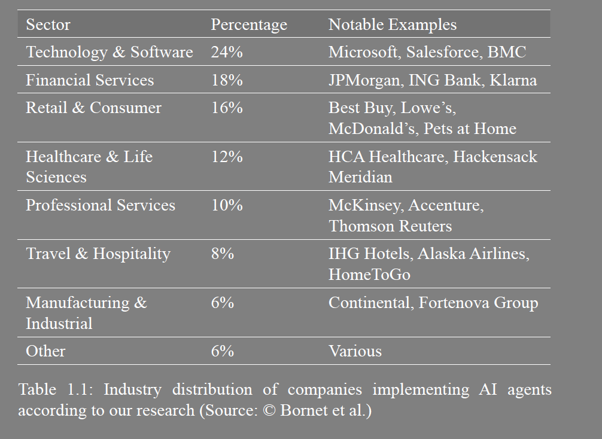
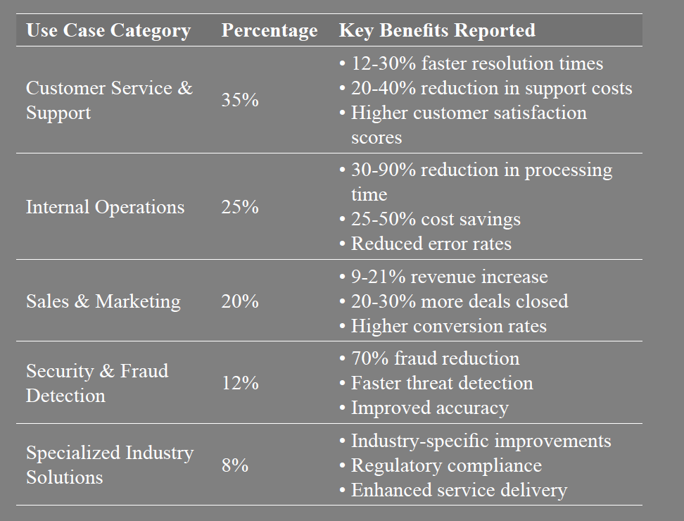
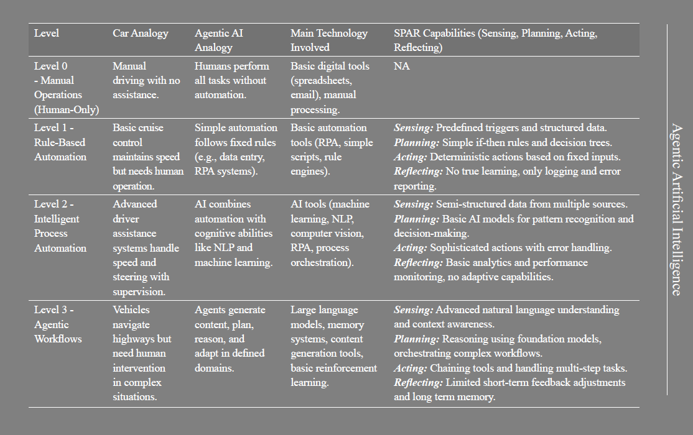
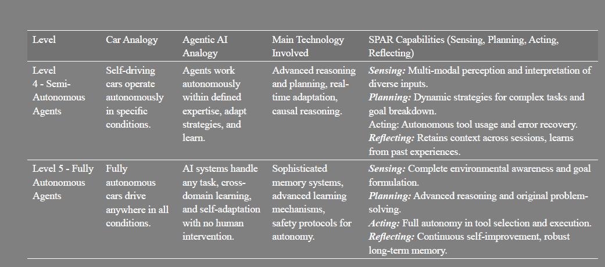

# chapter 1 / the rise of AI Agents

customer service
decision support
trsuting your AI teammates
demystifying how agent make decisions
data quality -> garbage in garbage out

P51
align with
business rules, values, regulatory requirements
reviewing crtical decisions
Agentic AI is augmentative : AI + Human

AI Agent Adoption
companies that have moved beyond rule-based agents and the conventional use of LLMs to deploy LLM-based AI agents

five primary categories where organizations are successfully deploying agents

Blueprint for Success : pilot programs + 1/ definition of the use cases 2/ strong change management 3/ robust techical infrastructure

Common challenges : system integration (choose 1/ API-First architecture 2/ regular testing 3/ validation procedures ) + Data Quality 

# CHAPTER 2 / THE FIVE LEVELS OF AI AGENTS: FROM AUTOMATION TO AUTONOMY

The binary classification of “agent” or “not agent” is problematic in the current AI landscape. Such rigid categorization fails to
capture the nuanced capabilities of different systems

The Instruction Paradox: Less is More : As we move up, instructions become more goal-oriented and abstract.

# CHAPTER 3 / INSIDE THE MIND OF AN AI AGENT

The Creativity Conundrum

cross-functional, end-to-end process like order-to-cash might involve thousands of specific
tasks.

multi-agent systems offer superior resilience

If you need to work with three different tools, create three specialized agents and one coordinator

Multi-agent system (MAS)

 hierarchical approach isn’t the only way to organize multi-agent systems

- Centralized Control
In this model, one agent—the orchestrator—acts as the conductor of our metaphorical orchestra, directing and coordinating all other agents.

- Decentralized Collaboration
Conversely, we have fully decentralized systems where all agents are peers, coordinating through direct communication without any central authority. Requires sophisticated coordination
[protocols](https://www.allaboutai.com/ai-glossary/contract-net-protocol/)

